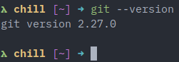

# Setup

To begin, you will have to install Git on your machine. The instructions to do so can be found [here.](https://git-scm.com/book/en/v2/Getting-Started-Installing-Git)

Once you have installed Git, open up your terminal or Git Bash (if you are on Windows) and type the following command to verify that Git has been installed. You should see that an appropriate number will be shown. As of the writing of this guide, the latest version of Git is `2.27.0`.

**Note*** the terminal/Git Bash/command prompt will all be referred to as the terminal for ease of reference. If you are unfamiliar with bash commands or batch commands, refer to [this guide](../08-bash-tutorial/README.md) for a quick tutorial.

```bash
git --version
```



You will also be using GitHub to manage your projects. More details about this will be explained in following chapters. To get started with GitHub, create an account [here.](https://github.com/) GitHub recently made private repositories with unlimited collaborators free.

Once both tools have been setup, you will have to configure Git on your machine. Within the terminal, type the following commands:

```bash
git config --global user.name "<Your name>"
git config --global user.email "<Your email used when setting up GitHub>"
```

The first command configures the names that each commit made will be assigned under. The second command configures the email that these commits will be made under. The email used should correspond with the email that you have used to create your GitHub account.

This is all you will need to setup your environment. Hooray!

[Next](../02-first-repository/README.md)
