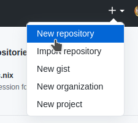
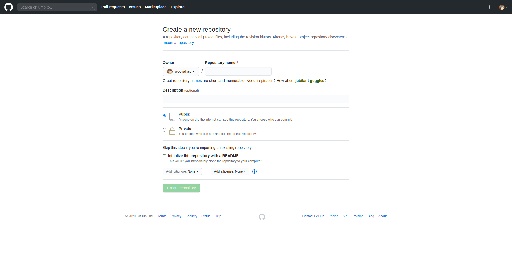
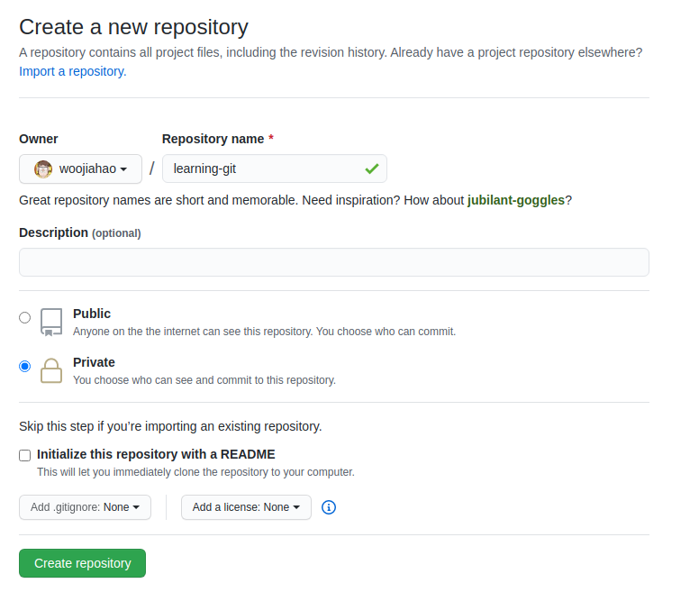
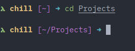
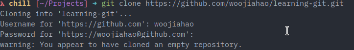
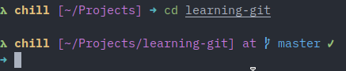
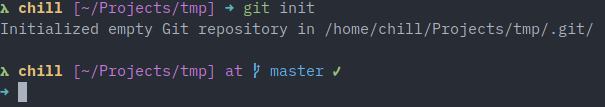

# Creating your first repository

Now that you have set up your environment, you are ready to start learning Git.

In this chapter, you will be learning the basic ideas surrounding Git and start using Git.

## Pre-requisite concepts

### Git

Simply put, Git is a [version control system](https://www.atlassian.com/git/tutorials/what-is-version-control#:~:text=Version%20control%20systems%20are%20a,a%20special%20kind%20of%20database.). According to the article, a version control system is

> ... a category of software tools that help a software team manage changes to source code over time. Version control software keeps track of every modification to the code in a special database

Git is not the first version control system but it is one of the most commonly used ones at present time. Other version control systems include [SVN](https://subversion.apache.org/) and [Mercurial.](https://www.mercurial-scm.org/)

A version control system tracks the "history" of changes to a piece of code over time. Git, in particular, is well-known as it allows developers to collaborate and work on a codebase without an active connection to a central code repository.

However, in order for collaboration to happen, Git requires a remote server to store this code history. There are plenty of free options available - one of which being Github which we will explore later.

There are also ways to create your own Git remote server ([more details](https://git-scm.com/book/en/v2/Git-on-the-Server-Setting-Up-the-Server)).

### GitHub

GitHub is a company that provides hosting for Git. This means that any code uploaded to the Git server is managed and maintained by GitHub.

GitHub is one of the most popular version control sites out there. Other options include [GitLab](https://about.gitlab.com/) and [BitBucket.](https://bitbucket.org/)

With the basic terminology out of the way, let's get into creating your first repository.

## First repository

There are two ways to create a repository. There are specific use cases for either and it's best that you are familiar with them.

**Note*** when following along with the guide, execute the code in the first method (GitHub first).

### GitHub first

In "GitHub first", the repository is created on GitHub (creating a remote repository first) before it is made available on your local machine (Do not worry about the remote vs local idea for now, this will be explained in chapter 3).

1. Login to GitHub and in the top-right corner of the menu bar, you should see a drop-down. Expand it and you will see an option for a "New Repository". Select this option.

    

2. You will be brought to a page where you can "customise your repository". You will have options to customise the following:

    

    **Note*** For the guide, we will be using the terms repository and project interchangeably.

    1. Repository name (mandatory)
    2. Repository description (optional)
    3. Private vs public repository (mandatory, public by default)
    4. README file (optional)
    5. License (optional)
    6. .gitignore (optional)

    This chapter will explain the first three concepts.

    Every time you wish to start a new project, you will create a new repository on GitHub. The repository's name is the name of the project that you will be working on. This can be any name that you wish to give it. However, common convention often has repository names using [kebab naming convetion](https://wprock.fr/en/blog/conventions-nommage-programmation/#Conventions-Le-Kebab-case-ou-Spinal-case) or [pascal naming convention.](https://wprock.fr/en/blog/conventions-nommage-programmation/#Conventions-Le-Pascal-case) For this guide, the project name chosen will be `learning-git`, but you can choose anything.

    The project's description is used to provide a brief description of what the project is about. For now, you can choose to leave this alone.

    Lastly, you can specify if the project is publicly-accessible or privately-accessible. For school projects or personal projects that you wish to keep under wraps, you can set the repository to private. This means that no one can view your repository unless you explicitly give them permission to do so. For open-source projects, you can set the repository to public so that other developers can view your code and use it. For this guide, this selection does not matter.

    

3. Now that you have created a project on GitHub, you can then create a local copy of this project on your local machine. Open your terminal and navigate to a folder where you wish to store your project. For now, we will store all projects in a `Projects/` folder found on your user directory (`/home/<user>` for unix-based systems and `C:\Users\<user>\` for Windows).

    **Note*** If you are unfamiliar with using the terminal, a quick guide on the basic commands used in this guide can be found in [chapter 8](../08-bash-tutorial/README.md) so if you need to, quickly jump over to familiarise yourself with them.

    ```bash
    cd ~/Projects/
    ```

    

    The process of creating a local copy of the project is known as "cloning". Through cloning, you will obtain the latest version of the remote repository on your local machine. You can perform changes on the local repository and upload them to the remote repository when done.

    In your empty repository page, you will notice that a URL is provided. Copy this URL to your clipboard and go to the terminal. The URL should have the following format: `https://github.com/<username>/<project name>.git`. For example, `https://github.com/woojiahao/learning-git.git`.

    ```bash
    git clone https://github.com/woojiahao/learning-git.git
    ```

    

    **Note*** You may be prompted for your GitHub credentials if you created a private repository.

    You will observe some logging messages show up. Once completed, check that the project has been cloned. `ls` should display that a new folder, `learning-git`, has been created in the folder you have navigated to.

    

    ```bash
    ls
    ```

4. Finally, you can navigate into your local copy.

    ```bash
    cd learning-git/
    ```

    

### Local machine first

Opposed to the previous method of creating a repository, the "local machine first" approach is useful when you already have an existing project on your local machine that you wish to upload to GitHub. You are essentially performing the previous method but in reverse: starting with a local repository and then creating a remote repository based on it.

1. Navigate to an existing project folder on your local machine.

    ```bash
    cd ~/Projects/existing-git-project/
    ```

2. When you're inside the project folder, run the following command.

    ```bash
    git init
    ```

    

    `git init` configures the current folder to be a local Git repository. Once this is configured, you are set.

3. Now, visit GitHub and you can repeat steps 1 and 2 in the previous section. The project name can still be anything that you want. However, it is important to note that you should leave all other fields, aside from 1-3, as it is.

    

5. In the terminal, ensure that you are within the local repository and execute the following commands. These commands will be covered in future chapters.

    ```bash
    git remote add origin <url>
    git add .
    git commit -m "Initial commit"
    git push -u origin master
    ```

    Let's break down these commands. More information about the specific commands will be elaborated on in the following chapters.

    - `git remote add origin <url>` - links the local repository to the remote repository
    - `git add .` - adds all current local files to the Git staging area
    - `git commit -m "Initial commit"`- commits the staged (added) files to indicate that you are saving these changes and want to make them permanent within the history of the project
    - `git push -u origin master` - uploads the current set of changes from your local repository to the remote repository, effectively making them available on GitHub. `-u` sets up a [tracking branch](https://git-scm.com/book/en/v2/Git-Branching-Remote-Branches#:~:text=Tracking%20branches%20are%20local%20branches,which%20branch%20to%20merge%20in.) (refer to the attached resource for more information, this guide will not cover what tracking branches are)
4. Once the repository is created, GitHub will again provide a URL for you to access the remote repository. Copy this URL to the clipboard and return to the terminal.

And there you have it! You have successfully uploaded an existing project to GitHub. You may have some questions about what each command does; fret not, the following chapters will go over them and hopefully build on your understanding of Git.

### Use case

To quickly recap the use cases of the repository creation patterns discussed above.

| Pattern | Use case |
|---|----|
|GitHub first |When creating a brand new project where no code is available yet |
|Local repository first|When uploading an existing project to GitHub|

Note that it is completely possible to use the local repository first pattern to create brand new projects. The use case mentioned above is the slightly more common approach to using the pattern.

[Next](../03-first-commit/README.md)
