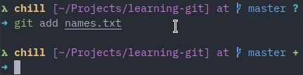
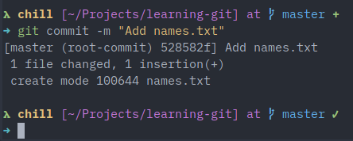

# First commit

Now that you have a repository setup, you can start to save and upload files. Before that, it is important to preface that this will be the most important chapter in understanding Git. As such, please read through each section carefully and properly understand how each command works.

To understand Git, you have to understand the core concepts in play.

## Core concepts

### Local vs remote

In the previous chapter, we referred to a repository on your local machine as a **local repository** while one that is created in GitHub as a **remote repository**. We had even added something called a `remote` to the local repository when using the "local machine first" repository creation pattern.

A local repository refers to a project residing on your local machine while a remote repository is one stored on a version control site like GitHub. When working with Git, a lot of the work performed will be done in your local repository. It can be thought of as a local copy of the code, unaffected by external changes to the remote repository unless such changes are pulled or "downloaded" from the remote repository.

A remote repository is like a central hub for any changes made on any number of local repositories. While a local repository can have any number of changes, these changes are not reflected on the remote repository unless explicitly pushed or "uploaded" to it. This is what makes Git an extremely powerful tool for developers - the ability to mess with the local copy of a repository without impacting the remote repository. Git goes a step further and allows users to roll back any changes in the event where there is a breaking change.

This then begs the question of how do we get our code from the local repository into the remote repository.

**Note*** It is possible to have more than one remote per project, this is a concept that we will return to in future chapters.

### Staging area

There are three locations that a file will "reside" in. The files do not exclusively "reside" in these locations but we will use this metaphor to make it easier to understand.

All files reside first in the **working directory.**

The next location that a file can reside in is the **staging area.** The staging area is similar to the one you might imagine in schools or convention centres. It is an area where the spotlight is cast on a select few files. A file that has been added to the staging area is "staged". It is also tracked by Git, which means that any changes made to the file will be tracked.

Only files that have been staged can be committed. Committing tells Git that you are confirming/committing to a set of changes and finalising these changes in the project's history.

Only files that have been committed can be pushed to a remote repository. The last location happens to be the **remote repository** where the files are uploaded to the remote repository for others to access.

If a local file changes while being tracked, Git will inform you that you will have to re-add the file. The file has to be re-staged as the current copy of the file is no longer the same as the copy in history, so you have to inform Git of these changes.

If this seems confusing, don't worry, once you start using the commands, it will be easier to understand how Git works.

The following diagram illustrates the concepts discussed above.


## First commit

Let's now put what we have learnt to practice. Following that last chapter, you should have

- Created a GitHub repository (remote repository)
- Cloned the remote repository on your local machine (local repository)
- Navigated to the loal copy in your terminal

1. Create a new file in the root of the project folder and add your name into it. You can do this from your file explorer (creating a new text file directly and editing it) or through the terminal.

    ```bash
    echo "Woo Jia Hao" > names.txt
    ```

2. View the current status of the work directory.

    ```bash
    git status
    ```

    

    `git status` will print the current status of the Git repository. You will notice that there will be one section - "Untracked files". Under it, there will be the new file, `names.txt` in red. This indicates that the file has not been staged.

    As we have established earlier, the untracked files/unstaged files are not yet on the staging area. So let's add it to the staging area.

3. Add the file (`names.txt`) to the staging area. This tracks the file and copies it to the staging area.

    ```bash
    git add names.txt
    ```

    

    A common convention of `git add` is `git add .` where `.` represents all the files that are available to be copied to the staging area. This is very useful when you have multiple files you wish to stage at once.

    To check that a file has been staged, you can run `git status` again. This time, the file should be green in color and under a new section called "Changes to be committed". This indicates that file has been staged successfully.

    

4. Once a file has been staged, the file is ready to be committed.

    ```bash
    git commit -m "Add names.txt"
    ```

    

    `git commit` is relatively straightforward. However, the `-m` is rather interesting. It provides a "commit message" for the commit which is the text in quotations following it. This commit message can be thought of as a short description of what the commit/change is about. Generally, commit messages should provide useful information about the commit where you can look back later and understand why changes were made without having to re-read the code.

    To check that a file has been successfully committed, you can run `git status`. This time, you will notice that there are no files in either the "Untracked files" or "Changes to be committed" sections.

    

5. Once a file has been committed, it can finally be pushed the remote repository. Pushing is in a sense uploading the latest set of changes to the remote repository. In our case, we have decided to create a new file called `names.txt`, add our name in it, and save/commit that change.

    ```bash
    git push origin master
    ```

    Git will take a while to process the request and may prompt you to fill in your GitHub credentials.

    

6. To verify that your changes have been made (adding `names.txt`), visit GitHub and navigate to the repository. You will now notice that there is a new file added, `names.txt`. Hooray!

    

    

You have successfully made your first commit! There may seem to be a lot of things to recall at once, but many of these become habit over time. The theory behind Git has to be explained to ensure that you have a clear mental model of what is going on so that future commands or chain of commands will make more sense. If you are unsure about anything discussed in this chapter, go over it once again. Ensure that you have a clear understanding of what each command can do.
