# Collaborating with others

While Git can be used as a tool for managing personal projects, its strongest attribute is allowing many developers to collaborate and work on a single project simultaneously. These developers do not need an active connection to the remote repository to work together, making it incredibly powerful for group projects.

There are many ways to use Git for collaborative efforts. However, this guide will explain the **fork and pull request workflow.** This workflow may seem daunting at first, but given enough practice, it becomes intuition and will be a powerful tool in your development arsenal no matter where you go.

As with the previous chapters, there is some basic terminology required that will be used throughout this chapter.

## Terminology

### Forking

When you wish to contribute to a project, the first step is to create a remote copy of that repository in GitHub.

Instead of cloning the repository first, GitHub has a feature known as `forking` where you create a copy of the original repository (owned by someone else) in your own GitHub account. This will be a remote copy of the original repository. Any changes that you wish to make can be pushed to this remote copy.

### Pull requests

When working on your own copy of a repository, you may want to submit your changes to the original repository for review and for these changes to be added/merged into the original repository.

To do so, you can create a pull requests. They allow developers to submit their changes to the original repository. These requests are then pulled down by the owner of the original repository and reviewed.

Pull requests are also referred to as merge requests as they are essentially a request to the owner of the original repository to merge your changes into the repository.

## Fork and pull request workflow

Before exploring a practical use case of the workflow, it is important to understand the underlying theory behind it.

There are two steps to the workflow, the first is how you can create a pull request and the other is how you can update your local copy with the latest changes from the original repository.

### Creating pull requests

1. In the top right corner of a repository page, there is a button labelled "Fork". Select this option and GitHub will begin creating a copy of this project into your own account.
2. With the repository forked, clone it with `git clone`.
3. In your terminal, you can choose to work on the project in two ways. This chapter focuses on the first approach. Branching is an optional topic that will be elaborated on in another chapter.
    1. **Working on the `master` (default) branch**
    2. Creating a feature/bug fix branch
4. Regardless of the method chosen above, to create a pull request, first push the local commits from the staging area to your remote copy of the repository. Then, using GitHub's interface, create a "Pull request"

    You will have to select the `base` and `compare` branches.

    The `base` branch will be a branch on the original repository and this branch will default to the `master` branch. This is the destination branch that you wish to merge your changes to (often being the `master` branch of the original repository).

    The `compare` branch will be a branch on your forked repository and this branch will default to the `master` branch. This is the branch containing your changes that you wish to merge.

5. The title and description of a pull request allows the owner of the repository to understand what the changes proposed does.

After this, everything else is left up to the owner. They are free to review the changes proposed and comment on them. GitHub supports a discussion forum per pull request so that others can chime in about the changes and further improvements that can be made before merging them into the original repository.

GitHub's pull request feature is very powerful but this guide will not go into detail about every feature available. If you are interested to learn more, refer to this guide [here.](https://help.github.com/en/github/collaborating-with-issues-and-pull-requests/about-pull-requests)

As the owner of a repository, you can choose to accept a pull request through GitHub's interface.

### Receiving the latest changes

Since Git allows developers to work on the same project simulatenously without an active connection to the central repository, how do developers receive the latest changes made to the original repository? Say someone else also added some of their changes and your copy of the repository does not have these changes.

This is done through pulling.

Pulling changes is akin to downloading the latest updates of a repository to the local copy. This ensures that the local repository has the latest copy of the original repository.

To receive changes from the original repository, some setup is required.

1. In your terminal, navigate to your project folder and add a new remote to the local copy called `upstream`.

    A project can have multiple remotes. The default is `origin` and often refers to the remote repository you own. To receive changes from the original repository (not your own), you will have to "link" your local repository to the original repository. This link is commonly named `upstream`.

    **Note*** that these remotes can be of any name, but `origin` and `upstream` are the most commonly used ones in this scenario.

2. Once the `upstream` remote has been setup, you can use `git pull` to pull the latest changes from the remote repository.
3. Once these change are pulled to your local repository, you can push them to your own remote repository using `git push`.

**Note*** If the remote repository has changes that are in conflict with your own local changes (i.e. the same line of the same file is modified in both repositories), you may encounter a "merge conflict". We will be discussing managing merge conflicts in the next chapter.

That is a simple overview of the fork and pull request workflow. We will now move onto an exercise to demonstrate this workflow.

## Practical

In a group, designate someone to be the owner of a repository. This can be the `learning-git` repository that you created previously or a new repository setup the same way as the `learning-git` repository (change the repository name this time!).

If your team is using the `learning-git` repository, all other members will have to delete their copy of the repository (refer [here](https://help.github.com/en/github/administering-a-repository/deleting-a-repository)). They have to delete the local copy of the repository too. This can be done using the file browser.

**Note*** If you created a private repository, you will have to add your team members as a collaborator for them to have access to it (refer [here](https://help.github.com/en/github/setting-up-and-managing-your-github-user-account/inviting-collaborators-to-a-personal-repository)).

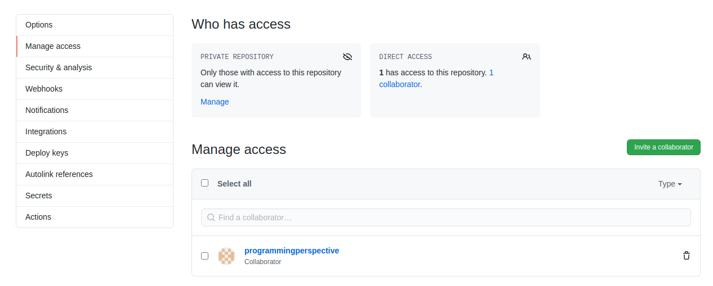

All members (excluding the owner) are to perform these steps first.

1. Fork the repository

    

    GitHub should begin creating a remote copy for your own account. Once done, you should see a page like this.

    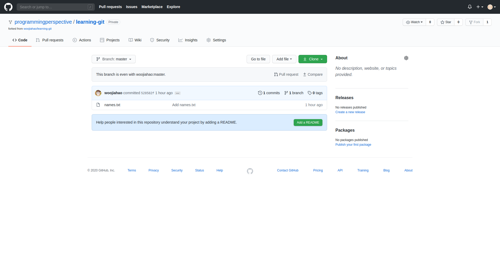

2. Clone the repository by clicking on the green "Clone" button and copying the repository URL

    ```bash
    git clone <repository url>
    ```

3. Navigate to the file in the file explorer or terminal
4. Create an `upstream` remote to the original repository

    ```bash
    git remote add upstream <original repository URL>
    ```

    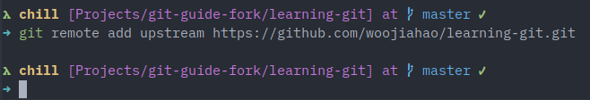

    The repository URL is the same URL that you used to clone a repository. However, this time, it can be found in the original repository.

    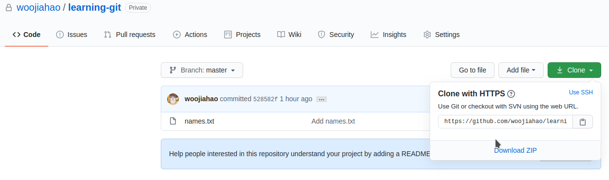

    To view all remotes available to you, use the `git remote -v` command to view both the alias of the remote and the URL of the matching repository. For example:

    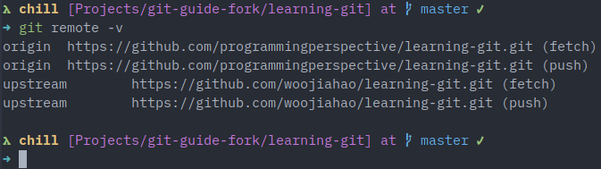

The following steps must be carried out by each member one after another. The owner of the repository **must** accept the pull request from each member first before the next member can proceed.

1. Before making any changes to the project, ensure that you have the latest changes of the repository by performing `git pull upstream master`

    ```bash
    git pull upstream master
    ```

    Later versions of Git may display an error, you can ignore that for now and fill in your credentials as per normal if prompted.

    If there are no changes to the original repository, you will see something like this:

    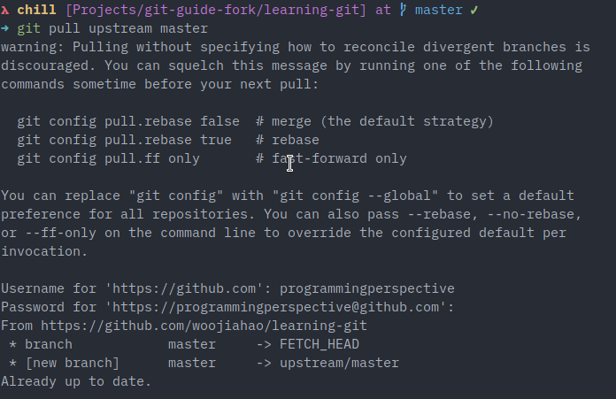

    If there are changes to the original repository, you will see something like this instead:

    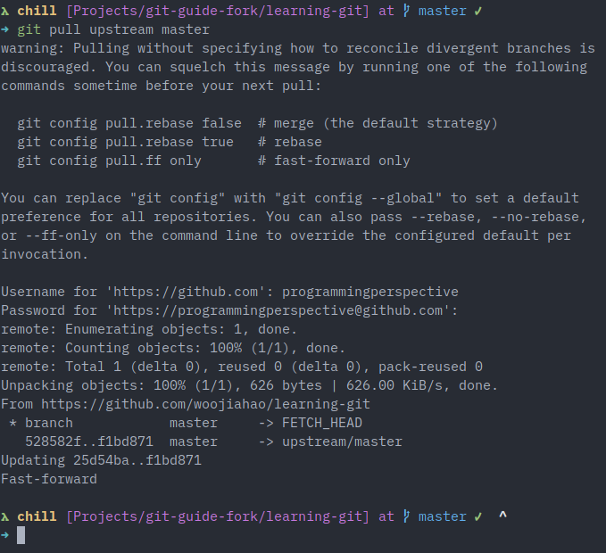

2. Add a new line to the file `names.txt`, this can be your name or any text. You can use a text editor.

    For example:

    ```
    Before (name.txt):
    Woo Jia Hao

    After (name.txt):
    Woo Jia Hao
    Andrew Ng
    ```

    **Terminal tip:** To quickly append text to a file, use the command `echo '<text>' >> <filename>` in bash. For example, `echo 'Woo Jia Hao' >> names.txt`

3. Add this change to the staging area and push it to your local repository

    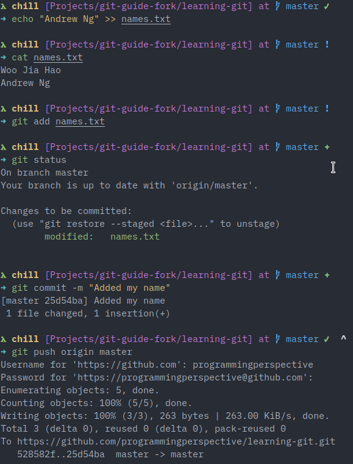

4. In GitHub, create a pull request where the `base` is the original repository's `master` branch and the `compare` is your copy of the repository's `master` branch. The title field is required while the others are optional. The pull request button can be found in your remote copy of the repository.

    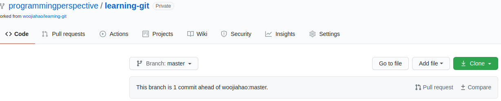

    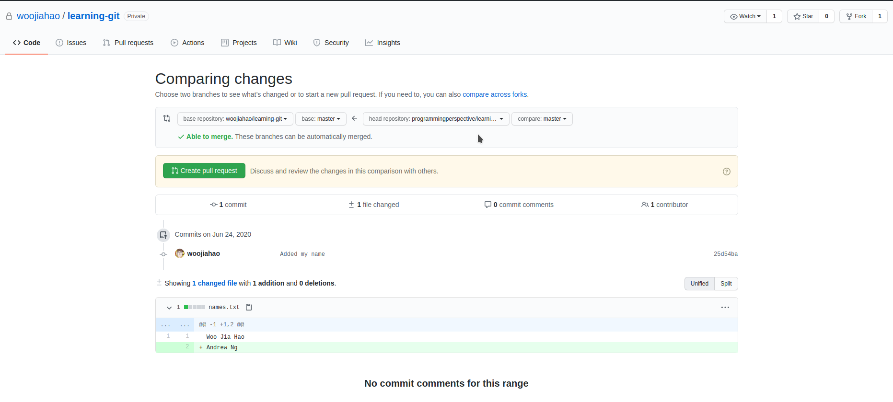

    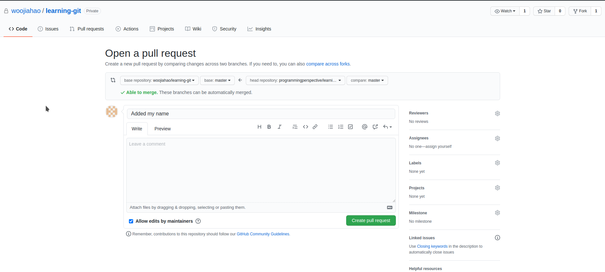

5. To create the pull request, click on the "Create pull request" button.

Once a member has created a pull request, the owner of the repository can view it in the repository under the "Pull requests" tab. They will now view a list of pending pull requests, which will be one from the member. Click onto the pull request in the list and they will be able to view the pull request. When the owner accepts this pull request (by clicking on the "Merge pull request" button), the changes proposed will be merged into the original repository. In the GitHub file brower, you can view the contents of `names.txt` and find that the new line added by the member is present.

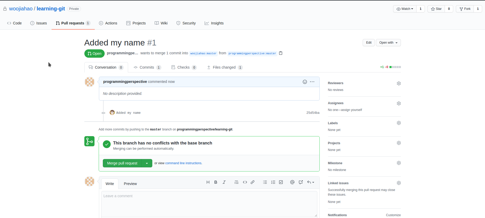


Once the owner has accepted the pull request and merged the changes, the next member can begin. Repeat the steps above ensuring that the latest changes are pulled from the `upstream` remote.

After one round of this, the original repository should have all of the team member's names in `names.txt`. Feel free to repeat this process a couple more rounds to properly understand the commands if necessary. You can choose to add any content to the file.

**Note*** If the owner is also working on the project, he/she can pull the latest changes directly from the `origin` remote as they own the repository already. There is no need to setup the `upstream`.

```bash
git pull origin master
```
