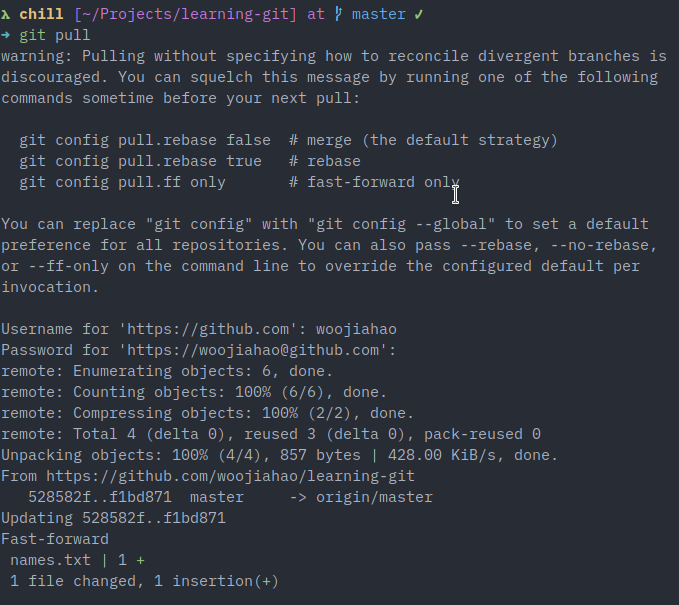
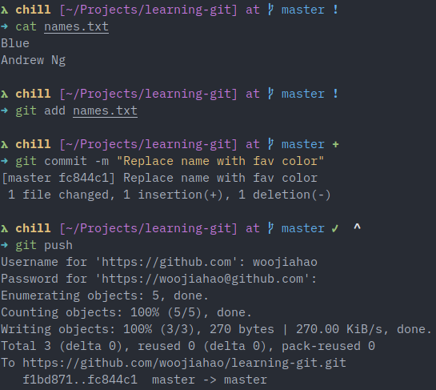
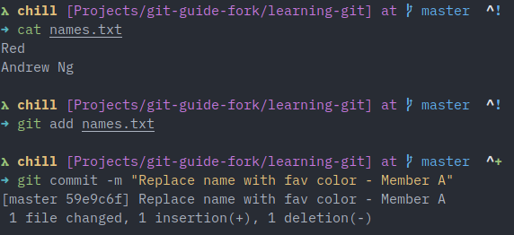
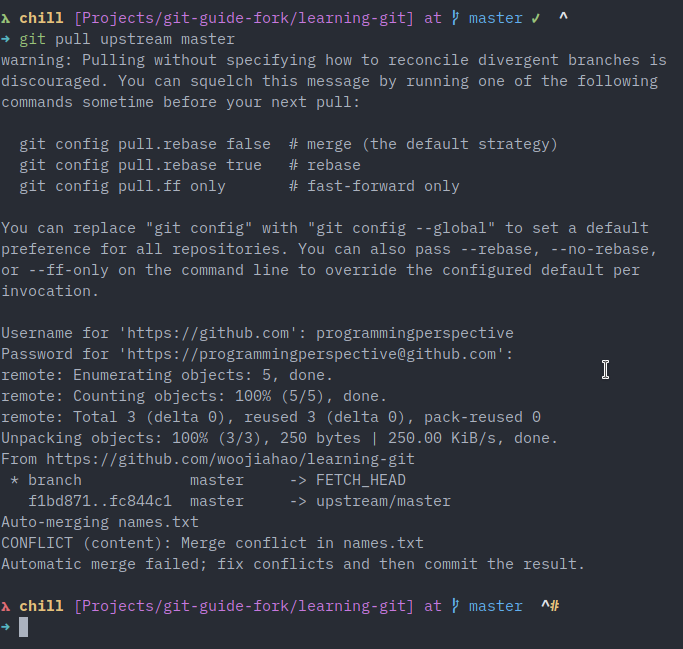

# Merge conflicts

Merge conflicts occur when the same line of a file is modified by two sources and these sources are attempting to merge with one another. They often occur when the line change is made before the latest changes have been pulled.

For example, the owner of the original repository changes the first line of `names.txt` to their favourite color, blue and pushes this change to the original repository. Then, member A also changes the first line of `names.txt` to their favourite color, red. However, this change is made before pulling from the `upstream`, thus causing a merge conflict at the first line.

When member A tries to pull from `upstream`, they will encounter a merge conflict informing them that the same line in the file has been modified in two sources.

While Git is powerful, it does not know whose changes to keep and whose to throw away, so it is up to you to inform Git which are the changes that should stay and which should go.

Let us first simulate a merge conflict.

For this mini-practical, every member should try simulating a merge conflict one. It is best to perform the following set of steps as one and only repeat them after the other person has completed it.

1. Following the previous chapter, the owner must pull the latest changes from their remote repository.

    

2. The owner will modify the first line of `names.txt` and change it to any text that they want. Once they are done, push this change to the original repository.

    

3. Member A will also make a modification (different from the owner) to the first line and commit it.

    

4. Member A will use `git pull` to get the latest changes from the original repository. A merge conflict will occur.

    

5. To view the status of the merge conflict, use `git status`. It will provide information about the files in question.

    

It is up to member A to fix this merge conflict on their end now.

Now to fix the merge conflict, open the file in question (`names.txt`) and you will notice that at the top of the file (or whereever the conflict happened), there will be an odd notation:

```
<<<<<<< HEAD (Member A's changes)
Red
=======
Blue
>>>>>>> fc844c137e0f6b7ead645f11c0b24f08c51b5202 (Owner's changes)
Andrew Ng
```

Between `<<<<<<< HEAD` and `=======` resides member A's changes. Between `=======` and `>>>>>>> fc844c137e0f6b7ead645f11c0b24f08c51b5202` resides the owner's changes or the incoming (pulled) changes. To fix the merge conflict, you will have to delete these markers and the content you wish to remove. For example, member A may wish to keep the owner's changes and discard their own, so they will delete everything else between the markers except the owner's changes.

```
Blue
Andrew Ng
```

Once done, the changes have been saved, add and commit the file again and this time, `git status` should show that the merge conflict has been resolved. Generally, the commit after fixing a merge conflict should indicate that the file was modified due to a merge conflict. As you can see, the error is gone.


Rotate this exercise between your members and try modifying various lines of code at once and resolving the merge conflicts that arise. It is hard to simulate all environments where you may receive a merge conflict so it is crucial that everyone understands how merge conflicts can be resolved so that future even if the file contents differ.

For the owner of the original repository, can you figure out how you can receive a merge conflict even if you own the project? Think about this for a while and see if you can simulate this as well.

To cause a merge conflict on your own repository, you will be acting as member B in the scenario above and instead of pulling changes from `upstrea`, you will pull them from `origin`.

# Final words

Congratulations! You have come to the end of the core chapters for this guide!

To learn more about advanced topic, please refer to the GitHub repository for this guide [here.](https://github.com/woojiahao/git-guide) More topics and erratas will be released there over time.

I wish you the best of luck in your journey to mastering Git!
