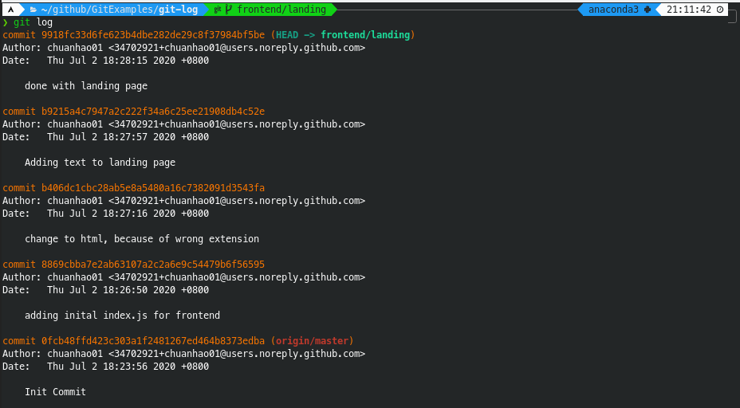
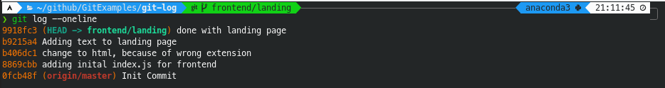

# Table of Contents
- [Table of Contents](#table-of-contents)
- [Git Log](#git-log)
  - [Project set up so-far](#project-set-up-so-far)
    - [Basic git log](#basic-git-log)
    - [Flags](#flags)
      - [oneline](#oneline)
      - [graph](#graph)
      - [all](#all)
  - [Wrapping up](#wrapping-up)
    - [Additional Resources to read](#additional-resources-to-read)
    - [GUI applications to help you visualise the git log](#gui-applications-to-help-you-visualise-the-git-log)
    - [Github:](#github)

# Git Log

Now that you know the basics of Git and have started working on the repository with a few commits, you might ask yourself, "How do we visualize these commits and changes we have made in the repository?"  

This is where this chapter, and the subsequent (`Git Diffs`), come in. These commands give you a way to visualize the commits and changes made in your Git repository.  

**TL|DR:** The command `git log` and its corresponding optional flags lets you look at the history of commits and how they link up in your repository.  

At the end of the chapter, there will be links to additional resources and more visual GUI tools you can use to look at the log of the repository. However, I still suggest reading and understanding how `git log` works as these tools still rely on the basic `git log` to generate their graphs. Having an understanding of this command gives you an intuition for how these tools work in general. Additionally, as the command comes with Git, there is no additional setup required to start using `git log`. 

Note:
This chapter serves to show you and explain the common use cases for the command. For a more detailed explanation, look at the additional resources or the documentation of the command.

## Project set up so-far

Let's say the project you are working on is a full-stack web application, with a frontend and backend.  
And you have decided to split the work to frontend and backend work, with respective features branches being worked on.

It may look something like this:  
```
Original repository branches:
master, backend/start-server (This will be remote branches for you)

Teammate A's branches (On your local machine):
master, origin/master, backend/start-server, origin/backend/start-server, frontend/landing (active)

Teammate B's branches:
backend/start-server (His local branch connected to github)
```

**Note: Assume you are teammate A**

Let's say at this point you have added some code and commits to the project and want to see what commits you had done.  
This could be because, you wanted to see where you left off yesterday or how many features have been completed. (The latter reason is when you are working on a larger feature)

### Basic git log

Well to look at all the commits made on your current branch you can do:
```bash
git log
```


From this screenshot you can see that although we can see all the commits linked to our current branch, there is a bit too much information at once.  
For example information like when the commit was made or who made it is not really important when trying to look at the bigger picture.  
This is also not practical when looking at projects with 10s or 100s of commits, as we would be lost in the information

### Flags

#### oneline

Luckily there are special flags we can use to format the output.  
If we add the flag, `--oneline`, git will shorten each commit to oneline, only preserving the important information.  
Looking at the man page for this command:  
```bash
Documentation:
--oneline
This is a shorthand for "--pretty=oneline --abbrev-commit" used together.
--abbrev-commit
Instead of showing the full 40-byte hexadecimal commit object name, show only a partial prefix. Non default number of digits can be specified with "--abbrev=<n>" (which also modifies diff output, if it is displayed).
```
Thus when running the command.
```bash
git log --oneline
```


And boom, this was what we wanted at the start. Now we can see that we have added the landing page and also changed the extension of the landing page.  

But there is something weird here...  
We can see that there is a commit tagged with origin/master, along with the commits of our current branch, frontend/landing. As we have established previously in chapter 6, all branches start off somewhere. In this example, the branch frontend/landing branches out from the origin/master branch. As such, git log makes a reference to this.

Luckily, we don't have to imagine these relationships between branches and commits as there is a flag that provides us with that visualization.

#### graph
As mentioned earlier, to display the relationships between branches and commits, we can use the `--graph` flag. This flag shows a 'graph' of the commits, or the relationship between branches and commits.  
Combining this with the `--oneline` flag we showed above, makes for a very clean and concise git log.  

(Try this out yourself and see what happens!)

```bash
git log --oneline --graph
```


Now that you know how to look at commits tagged to your branch, you might also want to see how the entire repository might look like.  
Luckily we have a flag to look at the log of the entire repository.  

#### all
The `--all` flag shows the `git log`, including all the commits from every branch you have in the repository.  
We will also be combining this flag with all previous flags to get the best overview of a project. (In our opinion)
```bash
git log --oneline --graph --all
```


Now we can see that our frontend landing page feature (`frontend/landing` branch) has already been merged down to the `master` branch of our local repository. Using `git fetch` (to fetch any changes from GitHub), we can see that teammate B has also made more commits on his feature branch and the local `backend/start-server` branch is behind.  

For a detailed explanation on how to read the graph, you can refer to these Stack Overflow answers:  

- [Need help interpreting git log --graph command](https://stackoverflow.com/questions/39772204/need-help-interpreting-git-log-graph-command)
- [How to read git log graph](https://stackoverflow.com/questions/5382255/how-to-read-git-log-graph)

## Wrapping up
To end off, the `git log` command actually has a lot more features and flags which are a bit more nuanced and situational. This chapter demonstrates the most commonly used features and flags which we hope will be useful to you.  

As mentioned above, below are additional resources.

### Additional Resources to read
- [More features of git log](https://www.atlassian.com/git/tutorials/git-log)
- [git log documentation](https://git-scm.com/docs/git-log)

### GUI applications to help you visualise the git log
- [VSCode extension (Git Graph)](https://marketplace.visualstudio.com/items?itemName=mhutchie.git-graph)


### Github
Actually there is a feature on GitHub that also allows you to visualise the graph of your repository.  
It is under `Insights` &rarr; `Network` in your respective GitHub repository.  

