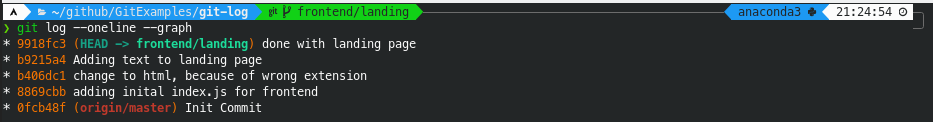

# Git Log

Now that you know how to do the basics in git and started working on the repo, a few commits in and you might ask yourslef, how do we visualize these commits and changes we have made in the repository?  

That is where this chapter, and the subsequent, `Git Diffs` come in. These commands give you a way to visualize the commits and changes made in your git respository.  

To explain simply, the command `git log` and its corresponding optional flags lets you look at history of commits and how the link up in your respository. At the end of the chapter there will be links to additional resources, as well as more visual GUI tools you can use to look at the log of the respository, but I still suggest reading and learning this chapter.  

This is because these tools still do rely on the git commands to generate their graphs, and understanding this command kind of gives you the 'feel' for it in general. Lastly, as this command comes with git, using the command does not require any additional setup other than having git.

Note:
This chapter serves to show you and explain the common use cases for the command. For a more detailed explaination, look at the addtional resources or the documentation of the command.

## Project set up so-far

Let's say the project you are working on is a full-stack web application, with a frontend and backend.  
And you have decided to split the work to frontend and backend work, with respective features branches being worked on.

It may look something like this:  
```
Github
origin/master, master

Teammate A
frontend/landing

Teammate B
backend/start-server
```

## Looking at the small picture

**Note: Assume you are teammate A**

Let's say at this point you have added some code and commits to the project and want to see what commits you had done.  
This could be because, you wanted to see where you left off yesterday or how features have or have not been done. (The later reason is when you are working on a larger feature)

### Basic git log

Well to look at all the commits made on your current branch you can do:
```bash
git log
```


From this screenshot you can see that although we can see all the commits linked to our current branch, there is a bit too much information at once.  
For example information like when the commit was made or who made it is not really important when trying to look at the bigger picture.  
This is also not practical when looking at projects with 10s or 100s of commits, as we would be lost in the information

### Flag oneline

Luckily there are special flags we can use to format the output.  
If we add the flag, `--oneline`, git will shorten each commit to oneline, only preserving the important information.  
```bash
git log --oneline
```


And boom, this was what we wanted at the start. Now we can see that we have added the landing page and also changed the extension of the landing page.  

But there is something weird here, we can also see that the `origin/master` commit together with the commits of our branch. This is because as we know, branches have to start off(be based off) somewhere. As such, we can make a pretty good guess that this `frontend/landing` was made off the master branch.  

Luckily, we don't have to guess as there is a flag which will show us the relationship between these commits.  

### Flag graph
To make git log show the relationships between commits, we just have to add the `--graph` flag. This flag shows a 'graph' of the commits, which for us means the relationship the commits have.  
Combining this with `--oneline` flag we showed above, makes for a very clean and concise git log.  

(I will leave it to the reader to try out what `--graph` flag does on its own)

```bash
git log --oneline --graph
```
