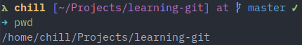
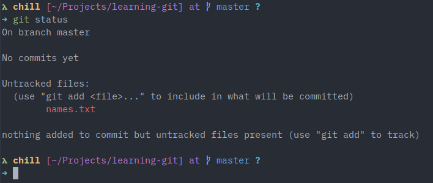
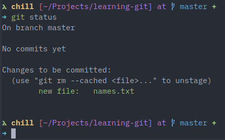
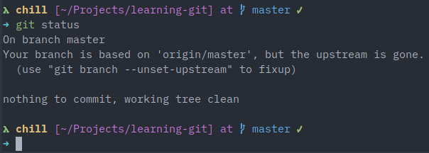
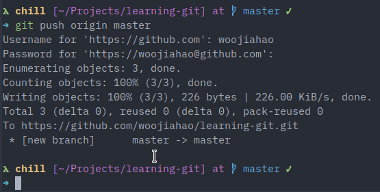
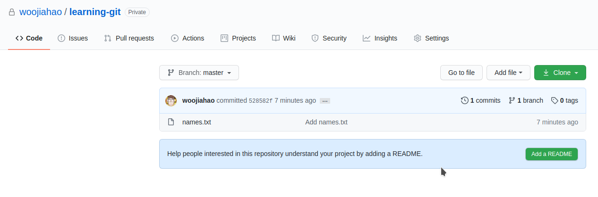
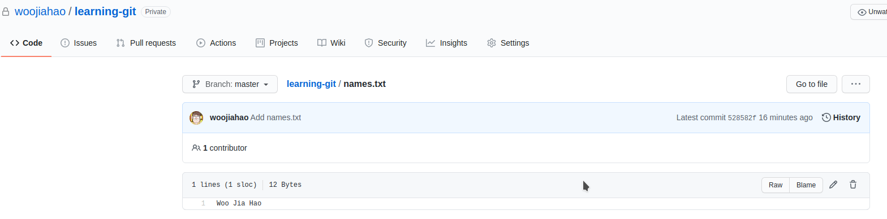
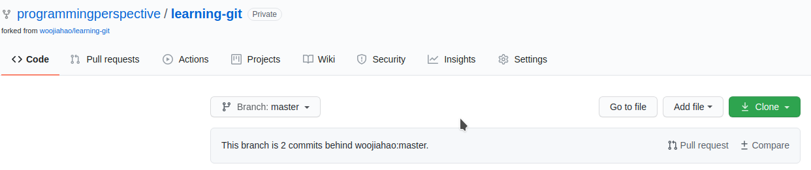

# Practical

This document contains all the practical information (from chapters 1 to 5) condensed into a single document - stripped of most explanations.

While this is a useful document for a quick glance, it is strongly advised that you read the referenced chapters per practical to ensure a proper understanding of the Git version control system.

## Table of contents

1. Setup
2. First repository
3. First commit
4. Fork and pull request workflow
5. Merge conflicts

## Setup

Setup Git and GitHub to begin following this guide. Original chapter [here.](../01-setup/README.md)

1. Install Git on your machine. Instructions [here.](https://git-scm.com/book/en/v2/Getting-Started-Installing-Git)

    **Note*** If you are using Windows, the Git installer will likely have installed something called Git Bash. For the remainder of this practical, this will be your goto terminal. While command prompt may be configured for use, the guide includes the use of bash commands that is only available on Git Bash. For more information about the basics on bash commands, refer to this [chapter]().

2. Create a new GitHub account. Instructions [here.](https://github.com/)
3. Configure Git on your local machine. The credentials used should match the credentials used for GitHub.

    ```bash
    git config --global user.name "<Your name>"
    git config --global user.email "<Your email used when setting up GitHub>"
    ```

## First repository

Next, you will be creating your first repository. While there are two ways to do so (as discussed in [chapter 2](../02-first-repository/README.md)), this practical uses the "GitHub first" approach.

**Note*** that the terms "repository" and "project" are used interchangably in the practicals.

**Note*** that the term "terminal" is synonymous with Git Bash or any UNIX-based terminal that uses bash.

1. Login to GitHub
2. Expand drop-down menu in the top-right corner of the menu bar
3. Select the "New Repository" option

    

4. Configure and create the repository, creating a remote repository

    For now, only change the project name to "learning-git" and the project visibility to "Private". Leave everything else as it is. For more information about the various options, refer to chapter 2.

    

5. Clone the repository to create a local repository

    For this practical, we will store all project folders inside a `Projects/` folder in the user directory of our local machine.

    ```bash
    cd ~/Projects/
    ```

    You will notice a repository link provided by GitHub. Copy that to your clipboard and use it when cloning the repository.

    

    ```bash
    git clone https://github.com/woojiahao/learning-git.git
    ```

    You will be prompted for your GitHub credentials if it is a private repository.

    To verify that the cloning is successful, use `ls` and you will find that a new folder called `learning-git` is now in the `Projects/` folder.

6. Navigate to the local repository

    ```bash
    cd learning-git/
    ```

    To verify that you are in your local repository, you can use `pwd`. The current folder should be `learning-git/` now.

    

## First commit

After creating the repository, you can start committing changes to your local repository and pushing them to your remote repository.

This chapter relies heavily on a broad understanding of the staging area (and the related locations a file can exist). These concepts are further explained in [chapter 3.](../03-first-commit/README.md)

This practical picks up right where the previous one ended.

1. Create a new file in the root of the project folder and add your name to the first line of the file

    This can be done using the file explorer or through the terminal.

    ```bash
    echo "Woo Jia Hao" > names.txt
    ```

2. View the current status of the working directory

    ```bash
    git status
    ```

    

    The new file should be in red under the "Untracked files" section as this is a new file that has yet to be staged once.

3. Add `names.txt` to the staging area to track it

    ```bash
    git add names.txt
    ```

4. Verify that the file has been added using `git status` once again

    The file should now be in green under the "Changes to be committed" section.

    

5. Commit `names.txt`, confirming that you wish to keep the changes made (in this case, creating a new file and adding your name to it)

    ```bash
    git commit -m "Add names.txt"
    ```

    The text that follows `-m` is the commit message. It should be a description of the changes made in the commits.

6. Verify that the file has been committed using `git status`

    

    The file will now no longer be shown.

7. Push this commit to the remote repository to upload these changes to the remote repository

    ```bash
    git push origin master
    ```

    

    You may have to enter your GitHub credentials.

8. You can verify that the changes have been pushed to GitHub on GitHub under the repository page

    

    There will be a new file added and you can view it in the built-in file browser for GitHub.

    

## Fork and pull request workflow

Now that you know how to push changes on your own. Let's explore how you can collaborate with others and share code among a team for group projects.

For this practical, appoint someone in your group to be the owner of the practice repository. The owner will then proceed to create a new repository, following the steps discussed in the previous chapters (including the first commit).

Since the new repository is a private repository, the owner of the repository must add your team members as collaborators for them to have access to it (refer [here](https://help.github.com/en/github/setting-up-and-managing-your-github-user-account/inviting-collaborators-to-a-personal-repository)).

**Note*** The following screenshots will have the repository name as `learning-git`. However, you will have to replace the name of the repository with whatever the owner sets the repository name to be.

All members (excluding the owner) are to perform the following steps first.

1. Fork the repository

    

    GitHub should begin creating a remote copy for your own account. Once done, you should see a page like this.

    

2. Clone the repository by clicking on the green "Clone" button and using the repository URL

    ```bash
    git clone <repository url>
    ```

3. Navigate to the file in the file explorer or terminal
4. Create an `upstream` remote to the original repository

    ```bash
    git remote add upstream <original repository URL>
    ```

    

    The repository URL is the same URL that you used to clone a repository. However, this time, it can be found in the original repository.

    

5. Use `git remote -v` to view both the alias of the remote and the URL of the matching repository

    

    Ensure that you have both an `origin` and `upstream` remote.

    **Note*** the repository URL for the `origin` and `upstream` remote must be different. The `origin` remote must point to your forked repository while the `upstream` remote must point to the original repository.

The following steps must be carried out by each member one after another. The owner of the repsoitry must accept the pull request from each member before the next member can proceed.

1. Pull the latest changes of the repository

    ```bash
    git pull upstream master
    ```

2. Add your name to the file `names.txt`

    This can be done in either a terminal or text editor.

    ```bash
    echo "Andrew Ng" >> names.txt
    ```

3. Commit this change and push it to your local repository

    ```bash
    git add names.txt
    git commit -m "Add name (Andrew Ng) to names.txt"
    git push origin master
    ```

4. Create a pull request in Github

    When you open your remote repository, you can create a pull request under the "Pull requests" tab.

    

    Confirm that you wish to create a pull request and you can leave the details of the pull request as it is (note that the title is always mandatory while the other fields are optional). More about pull requests is explored in [chapter 4.](../04-collaboration/README.md)

    

    

    Once the details of the pull request has been confirmed, you can select the "Create pull request" button.

Now that the pull request has been created, the owner can view it under the "Pull Requests" tab. The owner must accept the pull request which will merge the member's changes into the original repository. When in the "Pull Requests" tab, they will be able to view all pending pull requests in a list. For this practical, select the only pull request shown, so select that pull request and merge it but clicking on the "Merge pull request" button.


Now, if you view `names.txt` in the original repository in GitHub, you will be able to see the new name.

Once the owner has accepted the pull request, the next member can proceed. Repeat the steps above, ensuring that the latest changes are pulled from `upstream` every time.

After one round with all members, the original repository should have all the team member's names in `names.txt`. Repeat this process a couple more rounds to properly understand the commands. You can add any text.

**Note*** The owner can pull the latest changes directly from the `origin` remote as they own the repository already. There is no need to setup the `upstream`.

```bash
git pull origin master
```

## Merge conflicts

When working with others, you may encounter merge conflicts. These often happen when the same line of a file is modified by two sources and these sources are attempting to merge with one another.

As explained in [chapter 5](../05-merge-conflicts/README.md), we can simulate this by having the owner update and push a change to `names.txt` while the same line is also modified by another member without pulling the latest changes by the owner.

The following exercise should be conducted between the owner of the repository and another member, one at a time.

1. The owner must pull the latest changes from their remote repository

    ```bash
    git pull origin master
    ```

2. The owner will modify the first line of `names.txt` and change it to any text they want
3. The owner will commit and push this change to the original repository

    ```bash
    git add names.txt
    git commit -m "Change first line to favourite color"
    git push origin master
    ```

4. The member will make a modification (diferent from the owner) to the first line and commit it

    ```bash
    git add names.txt
    git commit -m "Add my favorite color"
    ```

5. The member will pull the latest changes from the original repository, causing a merge conflict

    ```bash
    git pull upstream master
    ```

    

6. `git status` can be used to view the status of the merge conflict

    ```bash
    git status
    ```

    

7. Open `names.txt` with a text editor, there will be a unique notation marking the area where the merge conflict is present

    This notation is further elaborated on in chapter 5 but this is the gist of what it describes

    ```
    <<<<<<< HEAD (Member A's changes)
    Red
    =======
    Blue
    >>>>>>> fc844c137e0f6b7ead645f11c0b24f08c51b5202 (Owner's changes)
    Andrew Ng
    ```

8. The member will remove their change and only keep the text "Blue" from the owner

    ```
    Blue
    Andrew Ng
    ```

9. The member will add and commit the resolution of the merge conflict

    ```bash
    git add names.txt
    git commit -m "Fix merge conflict - choose owner edit"
    git push origin master
    ```

Once this round is performed, another member can try to simulate a merge conflict with the original repository.

## Conclusion

This practical goes over a very brief version of the exercises described in each chapter. This practical is designed as a quick reference to understand the applications of Git.

It is highly recommended that you reference the formal chapters in this guide to gain a full understanding of the concepts described in this practical.

For more details on each topic, you can visit the GitHub repository for this guide [here.](https://github.com/woojiahao/git-guide) More chapters and erratas will be updated there.
